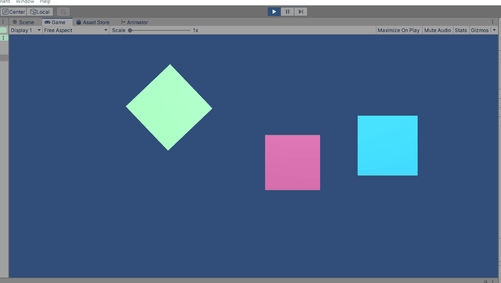

# music-visualizer    
### some code to help visualize music using Unity/C#    
    
    
    
    
    
    
    
    
    
    
    
    
    
check out the example scenes in `Assets/Scenes/examples`!    
    
check out a demo vid here: https://www.youtube.com/watch?v=Be3RcgCnSbE    
    